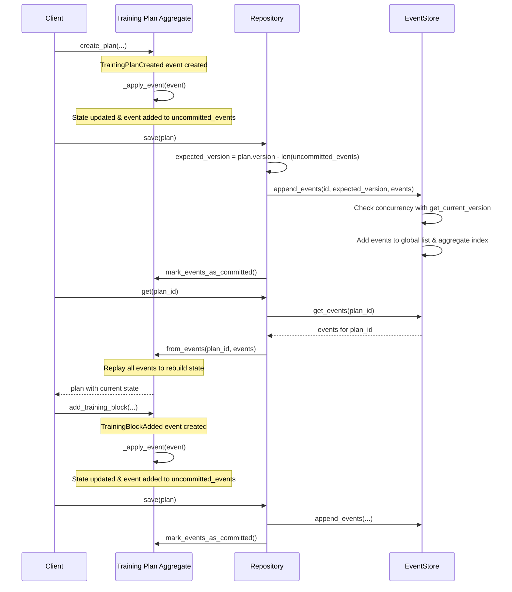

# Event Sourcing Tutorial

## Setup and run

```bash
uv venv .venv
uv sync
chmod +x src/main.py
src/main.py
```

## Event Sourcing Flow

This sequence diagram illustrates the flow of the event sourcing pattern as implemented in this tutorial:



The core pattern is:
1. Commands create events
2. Events update state (through _apply_event)
3. Events are saved to store (through repository)
4. Aggregates are rebuilt by replaying events

## Event Sourcing Architecture

```mermaid
graph TD
    subgraph Client["Client Application"]
        Commands["Commands"]
    end
    
    subgraph Domain["Domain Layer"]
        TrainingPlan["Training Plan Aggregate"]
        Event["Events"]
        subgraph Repository
            Save["Save(plan)"]
            Get["Get(plan_id)"]
        end
    end
    
    subgraph Storage["Persistence Layer"]
        EventStore["Event Store"]
        subgraph EventData
            GlobalLog["All Events (Chronological)"]
            AggregateIndex["Aggregate Events (By ID)"]
        end
    end
    
    Commands -->|"create_plan()\nadd_training_block()\nschedule_workout()..."| TrainingPlan
    TrainingPlan -->|"creates"| Event
    Event -->|"_apply_event()"| TrainingPlan
    TrainingPlan -->|"uncommitted_events"| Save
    Save -->|"append_events()"| EventStore
    EventStore -->|"stores in"| GlobalLog
    EventStore -->|"indexes by"| AggregateIndex
    Get -->|"get_events(id)"| EventStore
    AggregateIndex -->|"return events"| Get
    Get -->|"from_events(id, events)"| TrainingPlan
    
    style Event fill:#ffcccc
    style TrainingPlan fill:#ccffcc
    style EventStore fill:#ccccff